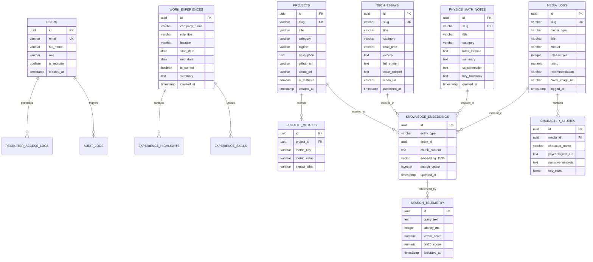

# PostgreSQL 16+ Database Architecture & ER Schema
## Ujjwal's Personal Archive & Knowledge Engine

This document defines the production-ready PostgreSQL 16+ database schema powering *Ujjwal's Personal Digital Archive & AI Search Engine*.

---

## 1. High-Level Entity Relationship (ER) Diagram



---

## 2. PostgreSQL DDL SQL Definition

```sql
-- 1. Enable Required Extensions
CREATE EXTENSION IF NOT EXISTS "uuid-ossp";
CREATE EXTENSION IF NOT EXISTS "vector";      -- pgvector extension for RAG search
CREATE EXTENSION IF NOT EXISTS "pg_trgm";     -- Trigram fuzzy text search

-- ============================================================================
-- 2. USERS & RECRUITER CLEARANCE TABLE
-- ============================================================================
CREATE TABLE users (
    id UUID PRIMARY KEY DEFAULT uuid_generate_v4(),
    email VARCHAR(255) UNIQUE NOT NULL,
    full_name VARCHAR(150) NOT NULL,
    role VARCHAR(50) NOT NULL DEFAULT 'visitor', -- 'recruiter', 'admin', 'visitor'
    is_recruiter BOOLEAN DEFAULT FALSE,
    last_access_at TIMESTAMPTZ,
    created_at TIMESTAMPTZ DEFAULT CURRENT_TIMESTAMP
);

-- ============================================================================
-- 3. WORK EXPERIENCES & CAREER ARCHIVE
-- ============================================================================
CREATE TABLE work_experiences (
    id UUID PRIMARY KEY DEFAULT uuid_generate_v4(),
    company_name VARCHAR(150) NOT NULL,
    role_title VARCHAR(150) NOT NULL,
    location VARCHAR(100) DEFAULT 'Remote',
    start_date DATE NOT NULL,
    end_date DATE, -- NULL indicates current role
    is_current BOOLEAN DEFAULT FALSE,
    summary TEXT NOT NULL,
    display_order INT DEFAULT 0,
    created_at TIMESTAMPTZ DEFAULT CURRENT_TIMESTAMP
);

CREATE TABLE experience_highlights (
    id UUID PRIMARY KEY DEFAULT uuid_generate_v4(),
    experience_id UUID NOT NULL REFERENCES work_experiences(id) ON DELETE CASCADE,
    bullet_text TEXT NOT NULL,
    display_order INT DEFAULT 0
);

-- ============================================================================
-- 4. PROJECTS & VERIFIED PRODUCTION METRICS
-- ============================================================================
CREATE TABLE projects (
    id UUID PRIMARY KEY DEFAULT uuid_generate_v4(),
    slug VARCHAR(150) UNIQUE NOT NULL,
    title VARCHAR(200) NOT NULL,
    category VARCHAR(100) NOT NULL, -- 'AI & WealthTech', 'Agentic AI', etc.
    company_tag VARCHAR(100),       -- 'ZFunds', 'Advor.ai', 'Open Source'
    tagline TEXT NOT NULL,
    description TEXT NOT NULL,
    github_url TEXT,
    demo_url TEXT,
    is_featured BOOLEAN DEFAULT TRUE,
    tags JSONB DEFAULT '[]'::jsonb, -- ["Python", "FastAPI", "Redis", "RabbitMQ"]
    created_at TIMESTAMPTZ DEFAULT CURRENT_TIMESTAMP
);

CREATE TABLE project_metrics (
    id UUID PRIMARY KEY DEFAULT uuid_generate_v4(),
    project_id UUID NOT NULL REFERENCES projects(id) ON DELETE CASCADE,
    metric_key VARCHAR(100) NOT NULL,   -- 'latency', 'concurrency', 'accuracy'
    metric_value VARCHAR(100) NOT NULL, -- '<150ms P99', '+40%', '500k users'
    impact_label VARCHAR(150) NOT NULL
);

-- ============================================================================
-- 5. TECH ESSAYS & SYSTEM ARCHITECTURE ARTICLES
-- ============================================================================
CREATE TABLE tech_essays (
    id UUID PRIMARY KEY DEFAULT uuid_generate_v4(),
    slug VARCHAR(150) UNIQUE NOT NULL,
    title VARCHAR(255) NOT NULL,
    category VARCHAR(100) NOT NULL,
    read_time VARCHAR(30) DEFAULT '5 min read',
    excerpt TEXT NOT NULL,
    full_content TEXT NOT NULL,
    code_snippet TEXT,
    video_url TEXT,
    published_at TIMESTAMPTZ DEFAULT CURRENT_TIMESTAMP
);

-- ============================================================================
-- 6. PHYSICS & MATHEMATICS FOUNDATIONS
-- ============================================================================
CREATE TABLE physics_math_notes (
    id UUID PRIMARY KEY DEFAULT uuid_generate_v4(),
    slug VARCHAR(150) UNIQUE NOT NULL,
    title VARCHAR(255) NOT NULL,
    category VARCHAR(100) NOT NULL, -- 'Quantum Mechanics', 'Neural Math'
    latex_formula TEXT NOT NULL,
    summary TEXT NOT NULL,
    cs_connection TEXT NOT NULL,
    key_takeaway TEXT NOT NULL,
    created_at TIMESTAMPTZ DEFAULT CURRENT_TIMESTAMP
);

-- ============================================================================
-- 7. SCREEN & SPINE (CINEMA, ANIME & LITERATURE ANALYSIS)
-- ============================================================================
CREATE TABLE media_logs (
    id UUID PRIMARY KEY DEFAULT uuid_generate_v4(),
    slug VARCHAR(150) UNIQUE NOT NULL,
    media_type VARCHAR(50) NOT NULL, -- 'anime', 'movie', 'book'
    title VARCHAR(255) NOT NULL,
    creator VARCHAR(200) NOT NULL,  -- Director / Author
    release_year INT NOT NULL,
    rating NUMERIC(3, 1) CHECK (rating >= 0 AND rating <= 10),
    recommendation VARCHAR(150) NOT NULL,
    cover_image_url TEXT,
    logged_at TIMESTAMPTZ DEFAULT CURRENT_TIMESTAMP
);

CREATE TABLE character_studies (
    id UUID PRIMARY KEY DEFAULT uuid_generate_v4(),
    media_id UUID NOT NULL REFERENCES media_logs(id) ON DELETE CASCADE,
    character_name VARCHAR(150) NOT NULL,
    psychological_arc TEXT NOT NULL,
    narrative_analysis TEXT NOT NULL,
    key_traits JSONB DEFAULT '[]'::jsonb,
    created_at TIMESTAMPTZ DEFAULT CURRENT_TIMESTAMP
);

-- ============================================================================
-- 8. UNIFIED HYBRID RAG VECTOR & FULL-TEXT INDEX TABLE
-- ============================================================================
CREATE TABLE knowledge_embeddings (
    id UUID PRIMARY KEY DEFAULT uuid_generate_v4(),
    entity_type VARCHAR(50) NOT NULL, -- 'project', 'essay', 'physics', 'screen_spine'
    entity_id UUID NOT NULL,          -- Polymorphic ID referencing source table
    chunk_content TEXT NOT NULL,
    embedding VECTOR(1536) NOT NULL,  -- OpenAI / BGE embedding vector
    search_vector TSVECTOR GENERATED ALWAYS AS (to_tsvector('english', chunk_content)) STORED,
    updated_at TIMESTAMPTZ DEFAULT CURRENT_TIMESTAMP
);

-- ============================================================================
-- 9. SEARCH & PERFORMANCE TELEMETRY LOGS
-- ============================================================================
CREATE TABLE search_telemetry (
    id UUID PRIMARY KEY DEFAULT uuid_generate_v4(),
    query_text TEXT NOT NULL,
    latency_ms NUMERIC(6, 2) NOT NULL,
    vector_score NUMERIC(5, 4),
    bm25_score NUMERIC(5, 4),
    executed_at TIMESTAMPTZ DEFAULT CURRENT_TIMESTAMP
);

-- ============================================================================
-- 10. INDEXES FOR SUB-15MS HYBRID SEARCH & PERFORMANCE
-- ============================================================================

-- HNSW Vector Index for Instant Cosine Similarity Search
CREATE INDEX idx_knowledge_embeddings_hnsw 
ON knowledge_embeddings 
USING hnsw (embedding vector_cosine_ops)
WITH (m = 16, ef_construction = 64);

-- GIN Index for High-Precision BM25 Full-Text Keyword Search
CREATE INDEX idx_knowledge_embeddings_fts 
ON knowledge_embeddings 
USING gin (search_vector);

-- Trigram Indexes for Fast Partial Matching & Search Bar Autocomplete
CREATE INDEX idx_projects_title_trgm ON projects USING gin (title gin_trgm_ops);
CREATE INDEX idx_media_logs_title_trgm ON media_logs USING gin (title gin_trgm_ops);
```
